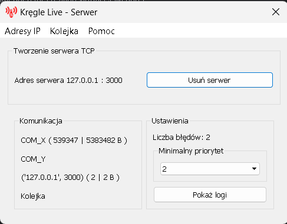
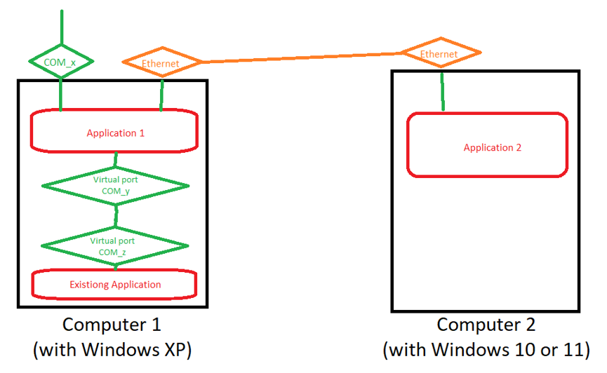

# KregleLive_3_Server

KregleLive_3_Server is an application designed to "listen" to messages transmitted via a serial port between a computer and bowling lanes. The application processes these messages and forwards them via TCP protocol to the [KregleLive_3_Client](https://github.com/patlukas/KregleLive_3_Client), which is part of a larger project. KregleLive_3_Server is intended to run on Windows XP, which is why it was written in Python 3.4.3.

To test the application's response to messages from the lanes, a testing tool is provided in the form of the **KregleLive_3_FakeLaneSim** application, available in the repository [link](https://github.com/patlukas/KregleLive_3_FakeLaneSim). This tool simulates the messages sent from the bowling lanes, allowing you to verify that **KregleLive_3_Server** correctly processes and forwards the data to the **KregleLive_3_Client**.

## Features

- **Serial Port Monitoring**: The application listens to messages transmitted via the COM port between the computer and the bowling lanes.
- **Message Processing**: Captured messages are processed and forwarded to KregleLive_3_Client via TCP protocol.
- **Configuration via JSON**: The application is configured using a `config.json` file, which allows customization of parameters such as COM ports, timeouts, log priorities, etc.
- **Executable Generation**: The application can be compiled into an executable (`.exe`) using PyInstaller.

## Recommended Software

- Operating System: Windows XP
- Python 3.4.3
- Dependencies listed in `requirements.txt` (install via `pip install -r requirements.txt`)
  - PyQt5 (version 5.4.1)
- `pyinstaller` for generating the executable
- **com0com**: Version 3.0.0.0 is recommended for creating virtual COM ports.

## Installation and Setup

### Steps to Build the Executable (`.exe`)

1. Install `pyinstaller`:
   ```bash
   pip install pyinstaller
   ```

2. Set the path to the project:
   ```bash
   set path=C:\path\to\KregleLive_3_Server
   ```

3. Generate the executable:
   ```bash
   pyinstaller.exe %path%\main.py --icon %path%\icon\icon.ico --name KL3S.exe --onefile --noconsole
   ```

   The executable will be generated in the `dist` folder.

### Alternatively

You can download the pre-built executable from the [Releases](https://github.com/patlukas/KregleLive_3_Server/releases) section.

## Configuration

The application is configured using the `config.json` file. Below is a description of the parameters:

- `path_to_dict_com0com`: Path to the `com0com` directory (recommended version: 3.0.0.0), which is required to create a virtual COM port for message transmission.
- `path_to_run_kegeln_program`: Path to the third-party program used to manage the bowling lanes.
- `flags_to_run_kegeln_program`: Arguments to run the above program (suggested: `"w b6 a x"`).
- `com_x`: COM port on which data is received from the lanes to the computer.
- `com_y`: COM port used for outgoing data from the application to the "kegeln" program.
- `com_z`: COM port used for incoming data to the "kegeln" program.
- `com_timeout`: Timeout for reading messages from the COM port.
- `com_write_timeout`: Timeout for writing messages to the COM port.
- `minimum_number_of_lines_to_write_in_log_file`: Number of new logs after which the physical log file is updated.
- `time_interval_break`: Break time (in seconds) between loop intervals.
- `min_log_priority`: Default minimum log priority that will be visible in the GUI (can be changed in gui).
- `default_ip`: Default IP address on which the application will listen for TCP connections (can be selected in gui).
- `default_port`: Default port used for TCP communication (can be changed in the GUI).
- `max_waiting_time_for_response`: Maximum time (in seconds) the program will wait for a response before sending the next message.
- `warning_response_time`: Time (in seconds) after which a first-level warning will be issued about a delayed response.
- `critical_response_time`: Time (in seconds) after which a second-level (critical) warning will be issued about a severely delayed response.
- `number_of_lane`: Number of bowling lanes managed by the application.

## Program Structure

The program consists of the following elements:

- **`program.exe`** - The main executable file of the application.
- **`config.json`** - A configuration file where all application settings are stored. This file is used to customize the program's behavior, such as COM port settings, timeouts, log priorities, and more. For details, see the **Configuration** section.
- **`icon/`** - A folder containing the `icon.ico` file, which is used as the application icon.
  - `icon.ico` - The application icon.
- **`logs/`** - A folder where log files are stored. Logs are automatically generated by the application and saved in this directory.
- **`Tools/`** - A folder where shortcuts to other programs can be placed. If a shortcut is present in the `Tools` folder, a top menu named **"Narędzia"** will appear in the application interface, allowing the user to launch the program.

#### Example Directory Structure:
```
program/
│
├── program.exe
├── icon/
│   └── icon.ico
├── logs/
│   └── app_log_2023-10-01.txt
├── Tools/
│   ├── program1.lnk
│   └── program2.lnk
└── config.json
```

#### How the "Narzędzia" Menu Works:
- If a shortcut (e.g., `program1.lnk`) is placed in the `Tools` folder, the application will automatically detect it and add it to the **"Narzędzia"** menu in the user interface.
- Clicking on the shortcut name in the menu will launch the corresponding program.

## Running the Application

After configuring the `config.json` file, run the `KL3S.exe` application. The application will automatically start listening on the specified COM ports.

## Logs

The application generates logs, which are written to a file. The minimum log priority visible in the GUI can be set in the configuration file.

## Dependencies

All required dependencies are listed in the `requirements.txt` file. Install them using:
```bash
pip install -r requirements.txt
```

## Screenshots

### Appearance of the application:


### Runtime environment diagram (this program is as: "Application 1"):

